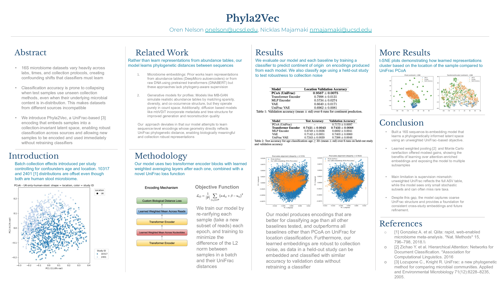

# Phyla2Vec

This project develops a generalized phylogeny-aware encoding mechanism for microbiome data, aimed at unifying 16S rRNA samples collected with different collection protocols and batch effects. We use studies and their different batch effects to demonstrate slight out-of-distribution offsets that make cross-study comparisons noisy, limiting the effective size of training data for health classification tasks.

We use a bidirectional transformer architecture to learn phylogeny aware UniFrac aligned embeddings of microbiome samples robust to collection variance. The idea is to create a batch collection agnostic pipeline capable of augmenting microbiome datasets, improving classifier generalization and removing the need to compute unifrac / phylogenetic distances for 16S rRNA sequences before downstream classification.  We start with (batch, sample, reads, nucleotides) and through learned average pooling end up with (batch, sample, embedding). This project is exploratory work following discussions with the UCSD Knight Lab.

Results:



## Env setup

### Setup

```bash
conda env create -f environment.yml
conda activate phyla2vec

# to update env
conda env update -f environment.yml

# install the right PyTorch for your machine:
# macOS:
pip install torch torchvision torchaudio
# Windows/Linux with NVIDIA:
conda install -c pytorch -c nvidia pytorch torchvision torchaudio pytorch-cuda=12.1
```

## Data

### How to get the assembled datasets for this project?

```bash
https://drive.google.com/drive/folders/1ZoZcNtGAhEce-K6ldiekuRoMCkAK3RBy?usp=sharing
```

### Data fetching and cleaning steps:

Stool samples represent the gut microbiome. How many stool samples exist in all contexts?

Input:

```bash
redbiom search metadata "where sample_type in ('Stool','stool')"| wc -l
```

Output:

```bash
48244
```

The American Gut Project (study number 10317) is the largest collection of human stool samples in redbiom. What sample types exist in AGP and their counts?

Input:

```bash
redbiom search metadata "where qiita_study_id == 10317" | redbiom summarize samples --category sample_type
```

Output:

```bash
Stool	29369
control blank	4987
Mouth	2587
Blood (skin prick)	1166
Forehead	833
skin of cheek	400
Left Hand	397
Right Hand	322
Nares	202
Vaginal mucus	149
Torso	126
LabControl test	112
Mucus	98
not provided	81
Axilla	59
Ear wax	59
Tears	55
Left leg	53
not applicable	32
Hair	21
Right leg	9
control positive	3
```

What are all the contexts that exist for 150bp?

```bash
redbiom summarize contexts \
  | grep -Ei 'Deblur.*16S.*.*150nt'
```

- output a text file of all 150nt contexts

```bash
redbiom summarize contexts \
  | grep -Ei 'Deblur.*16S.*150nt' \
  | awk '{print $1}' > ctx_list.txt
```

1. Let's assemble stool datasets by context

Create for single:

```bash
export ctx=Deblur_2021.09-Illumina-16S-V4-150nt-ac8c0b
```

```bash
redbiom search metadata "where sample_type in ('Stool','stool')" \
| redbiom fetch samples --context "$ctx" --output v4_stool.biom
```

Create for multiple contexts:

```bash
chmod +x run_stool.sh
./run_stool.sh
```

Inspect Biom table

```bash
# summarize
biom summarize-table -i v4.biom -o v4_summary.txt

# ids to stdout
biom table-ids -i v4_stool.biom
```

5. Clean table from blanks, negs, technical replicates and insufficient depth if any exist.

```bash
python data_cleaning/clean_biom.py \
 --table data/v4_stool/v4_stool.biom \
 --ambiguities data/v4_stool/v4_stool.biom.ambiguities \
 --out data/v4_stool/v4_stool_cleaned.biom \
 --clip-count 5000
```

**beware**!!! of running commands that require stdin. They will hang forever even if you think they are doing something.

```bash
#command causes redbiom to hang as select samples-from-metadata waits for stdin input.
#This is not well documented.  No error is thrown.
redbiom select samples-from-metadata |redbiom search samples --context $ctx
```

6. Filtering features in dataset - Run each dataset though greengenes 2 https://github.com/biocore/q2-greengenes2 filter function compare with phylogeny. We use 2024.09.phylogeny.asv.nwk.qza as reference. You will need to install QIIME2 thru your platform of choice. Here we use docker.

Docker commands for QIIME2

```bash
# I had oom issues with the next computing step so increasing memory to 23gb worked via docker desktop.
docker run --rm -it \
  --platform linux/amd64 \
  -v "$(pwd)":/data \
  quay.io/qiime2/amplicon:2025.10 \
  bash
```

Setup docker environment

```bash
source activate qiime2-2025.10

#get gcc which you will need for pip install, greengenes2 does not mention this dependency
apt-get update && apt-get install -y build-essential
# install greengenes2
pip install q2-greengenes2

# if it doesn't see greengenes plugin, try this
qiime dev refresh-cache   # make QIIME 2 see the new plugin

```

Greengenes2 Usage

Convert from biom to qza

```bash
qiime tools import \
  --input-path v4_stool_cleaned.biom \
  --type 'FeatureTable[Frequency]' \
  --input-format BIOMV210Format \
  --output-path v4_stool_cleaned.qza
```

Greengenes2 filtering

```bash
qiime greengenes2 filter-features \
    --i-feature-table v4_stool_cleaned.qza \
    --i-reference 2024.09.phylogeny.asv.nwk.qza \
    --o-filtered-feature-table v4_stool_cleaned_filtered.qza
```

```bash
qiime tools export \
  --input-path v4_stool_cleaned_filtered.qza \
  --output-path v4_stool_cleaned_filtered_biom
```

Create subset qza file of our filtered table for unifrac calculations downstream based on our filtered table

```bash
qiime phylogeny filter-tree \
  --i-tree 2024.09.phylogeny.asv.nwk.qza \
  --i-table v4_stool_cleaned_filtered.qza \
  --o-filtered-tree table-tree.qza
```

Conververt this file to newick for unifrac calculations downstream

```bash
qiime tools export \
  --input-path table-tree.qza \
  --output-path exported-tree
# gives exported-tree/tree.nwk
```

Compute unifrac distance matrix for filtered table

```bash
qiime diversity beta-phylogenetic \
  --i-table v4_stool_cleaned_filtered.qza \
  --i-phylogeny 2024.09.phylogeny.asv.nwk.qza \
  --p-metric unweighted_unifrac \
  --o-distance-matrix unifrac.qza
```

Export

```bash
qiime tools export \
  --input-path unifrac.qza \
  --output-path exported-dist
```

Convert from qza to biom

7. Get metadata for cleaned dataset

```bash
# via stdin

biom table-ids -i feature-table.biom | redbiom fetch sample-metadata --context "$ctx" --all-columns --output sample-all-col-metadata.txt
```

8. Get dataset metadata for downstream analysis
   check out https://qiita.ucsd.edu for more info on metadata fields.

9. Remote work

```bash
# start once
tmux new -s work

# later, from any SSH login
tmux attach -t work

# when you need to leave but keep things running
Ctrl-b d
```

## Testing encoder

Experiments/Findings (lower the better over baseline 81% mean pooling):

- Attention pooling linear -6% corr over mean pooling
- Attention pooling non linear -5% corr over mean pooling
- Rarefaction every 1 epochs and 3800 reads -2% corr over every 5 epochs and 1024 reads. Shows that more frequent rarefaction and higher read counts help a tiny bit. Maybe it sees more of the training distribution.
- Rarefaction every 10 epochs and 3800 reads did worse +1% from every 5 epochs and 1024 reads, given linear attention pooling. Less training distribution coverage, less rarefaction, maybe the amount of rarefaction > read count in terms of importance of representing the true distribution.
